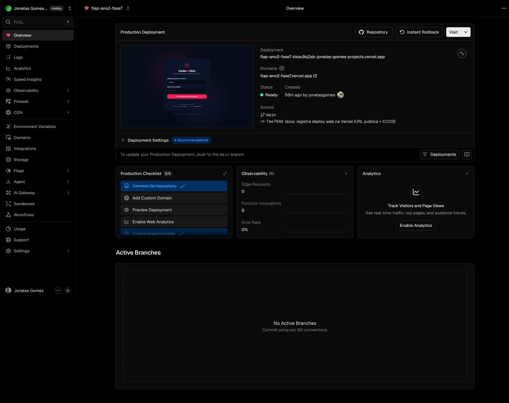
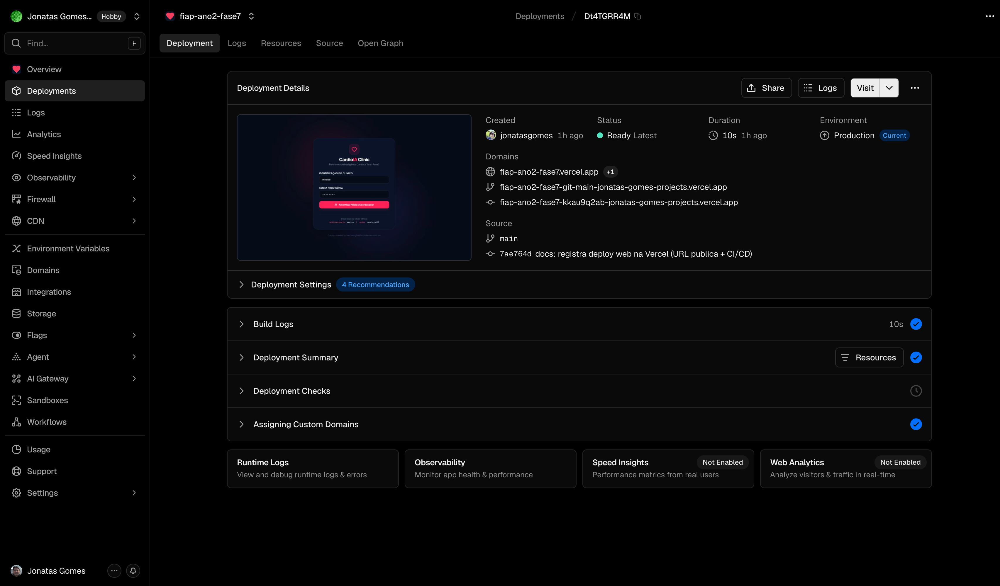
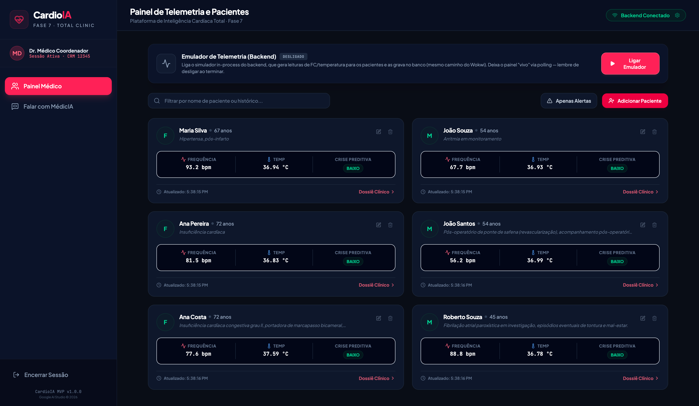
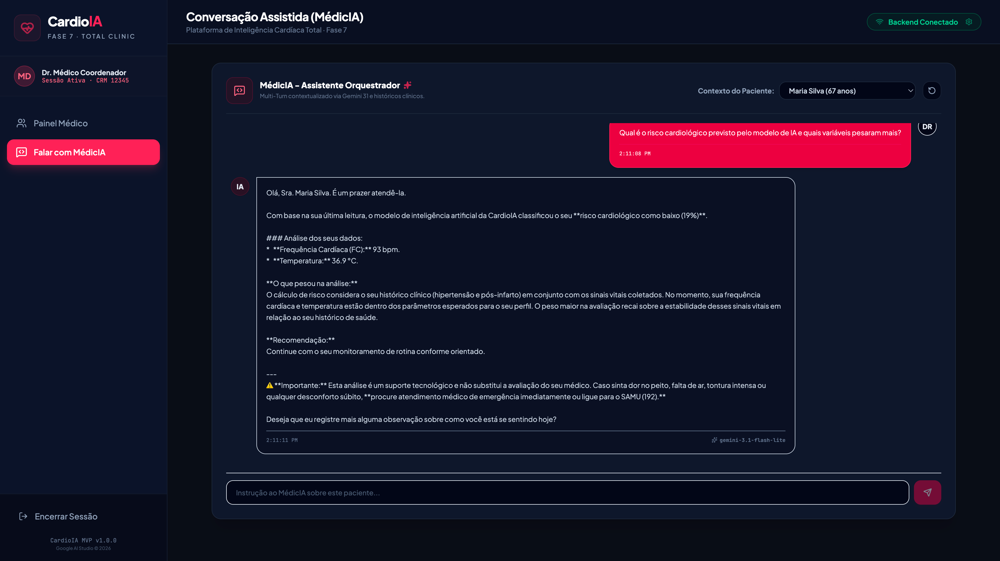
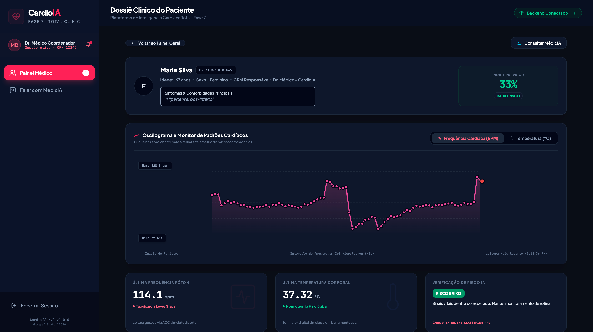
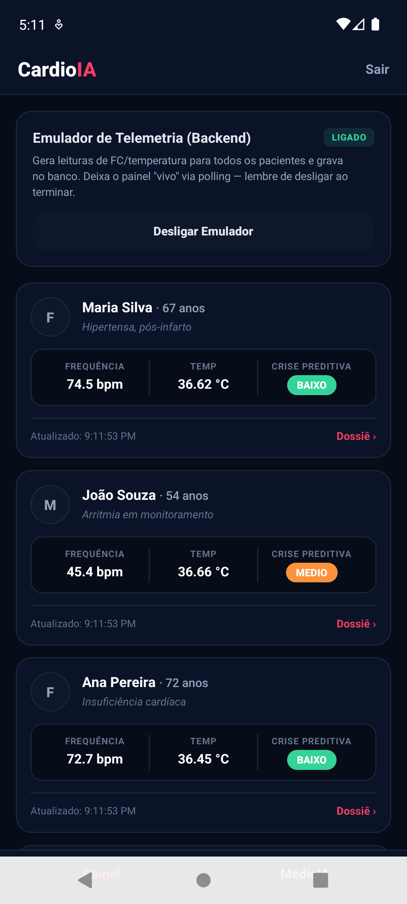
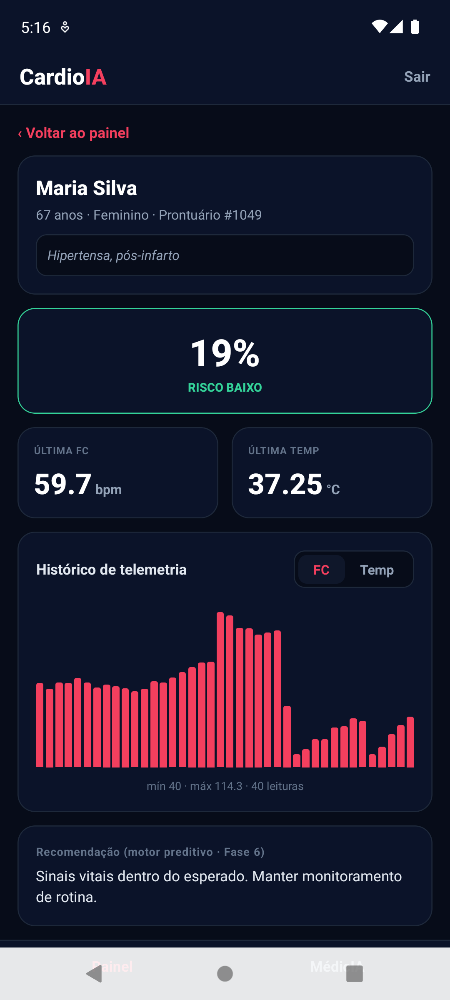
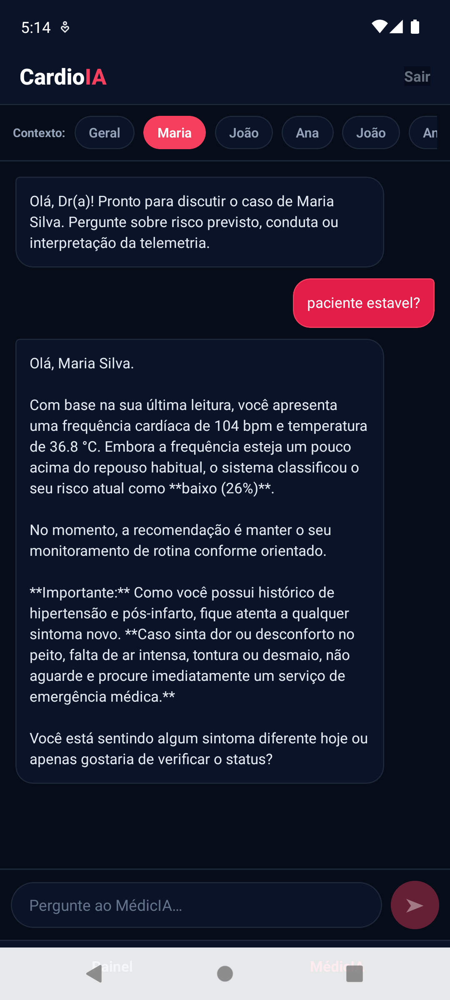

# FIAP - Faculdade de Informática e Administração Paulista

<p align="center">
<a href="https://www.fiap.com.br/"></a>
</p>

<br>

# CardioIA — Plataforma de Inteligência Cardíaca Total

## GRUPO 14 · Fase 7 — Coração Sob Controle: Previsão de Crises com IA

MVP final que integra todas as fases do projeto CardioIA num ecossistema único: **sensores (IoT em MicroPython) → backend Python → motores de IA → interfaces Web e Mobile**, com persistência em Oracle e exposição HTTPS via Cloudflare Tunnel.

## 👨‍🎓 Integrantes:
- <a href="https://www.linkedin.com/in/amanda-fragnan-b61537255">Amanda Fragnan de Oliveira</a>
- <a href="https://www.linkedin.com/in/iolanda-helena-fabbrini-manzali-de-oliveira-14ab8ab0">Iolanda Helena Fabbrini Manzali de Oliveira</a>
- <a href="https://www.linkedin.com/in/jonatasgomes">Jônatas Gomes Alves</a>
- <a href="https://www.linkedin.com/company/inova-fusca">Murilo Carone Nasser</a>
- <a href="https://www.linkedin.com/in/pedro-eduardo-soares-de-sousa-439552309">Pedro Eduardo Soares de Sousa</a>

> Grupo de **5 integrantes** — elegível ao ponto extra (equipe de 4–5).

## 👩‍🏫 Professores:
### Tutor(a)
- <a href="https://www.linkedin.com/in/leonardoorabona">Leonardo Ruiz Orabona</a>
### Coordenador(a)
- <a href="https://www.linkedin.com/company/inova-fusca">André Godoi Chiovato</a>

## 📜 Descrição

O **CardioIA** é o MVP final da Fase 7: uma plataforma de inteligência cardíaca que recebe telemetria de sensores (frequência cardíaca e temperatura), classifica o risco de crise com um **motor preditivo (Fase 6)**, oferece um **assistente conversacional (Fase 5, Gemini)** e entrega tudo em tempo real para interfaces **Web** e **Mobile**. O núcleo integrador é um backend **Python/FastAPI** com API em pt-BR e autenticação Bearer. Enunciado completo em [`assets/atividade-fase-7.docx`](assets/atividade-fase-7.docx).

### Arquitetura

```
 Sensores (Wokwi/ESP32, MicroPython)
        │  POST /telemetria
        ▼
 Backend FastAPI (OCI + Cloudflare Tunnel, HTTPS)
   • Motor preditivo Fase 6 (sklearn) → risco
   • Assistente Fase 5 (Gemini) → /assistente
   • Oracle ADB (histórico) · auth bearer
        │  REST + polling (Bearer JWT)
        ▼
 Web (React+Vite, Vercel)  &  Mobile (React Native+Expo, APK)
```

**Diagrama detalhado** (blocos, sequências e camadas): [`assets/arquitetura.md`](assets/arquitetura.md) · [**PDF**](assets/arquitetura.pdf). Contrato da API: [`backend/README.md`](backend/README.md).

## 📁 Estrutura de pastas

| Pasta | Conteúdo | Responsável |
|---|---|---|
| [`backend/`](backend/) | API FastAPI, motores de IA (Fase 5 + 6), emulador, deploy | Backend |
| [`iot/`](iot/) | MicroPython + projeto Wokwi (`diagram.json`) | Backend |
| [`frontend/`](frontend/) | App **Web** — React + Vite + TS (deploy na Vercel) | Frontend Web |
| [`mobile/`](mobile/) | App **Mobile** — React Native + Expo (APK via EAS) | Mobile |
| [`assets/`](assets/) | Logo, enunciado, [handoff backend↔frontend](assets/handoff-backend-frontend.docx), relatório de arquitetura e prints | Equipe |
| `README.md` | Este guia geral do projeto | — |

## 🔧 Como executar o código

- **Backend + IoT:** veja [`backend/README.md`](backend/README.md) e [`iot/README.md`](iot/README.md).
- **Web:** veja [`frontend/README.md`](frontend/README.md). **Mobile:** veja [`mobile/README.md`](mobile/README.md).

### 🚀 Deploy

- **Backend:** **no ar** na OCI via Cloudflare quick tunnel (HTTPS, Oracle ADB + Gemini). URL atual, endpoints e operação em [`backend/README.md`](backend/README.md).
- **Web (Vercel):** **no ar** em <https://fiap-ano2-fase7.vercel.app> — push na `main` dispara deploy (CI/CD); `vercel.json` com rotas SPA. Login demo: `medico` / `cardioia123`.
- **Mobile (EAS):** app Expo em [`mobile/`](mobile/) pronto (Login + Painel + Dossiê + MédicIA); `npx eas-cli build -p android --profile preview` gera o `.apk`. Ver [`mobile/README.md`](mobile/README.md).

### 🔗 Links públicos

| Recurso | URL |
|---|---|
| Web (Vercel) | <https://fiap-ano2-fase7.vercel.app> |
| APK (Expo/EAS) | [build `26e57b8a`](https://expo.dev/accounts/jonatasgomes/projects/cardioia-mobile/builds/26e57b8a-7a93-4674-8b1c-07c28ce447b4) |
| Vídeo demo (YouTube) | <https://youtu.be/GshJAD2Y2nk> |
| Simulação Wokwi | <https://wokwi.com/projects/465422293593149441> |
| API (Cloudflare Tunnel) | `https://college-anonymous-thesaurus-assumption.trycloudflare.com` ⚠️ efêmera |

> A URL da API é **efêmera** (quick tunnel, sem domínio). Pegue a vigente com:
> `ssh oracle-large-br "journalctl -u cloudflared-quick | grep -Eo 'https://[a-z0-9-]+\.trycloudflare\.com' | tail -1"`
> **Endpoints, exemplos e operação:** [`backend/README.md`](backend/README.md).

## 📸 Evidências do deploy

Deploy de produção **`Ready`** na Vercel (commit `7ae764d`, branch `main`), com **CI/CD** ("push to the main branch") e build em ~10 s:





App publicado em **`fiap-ano2-fase7.vercel.app`** — sessão iniciada, indicador **"Backend Conectado"** e painel com os 6 pacientes consumindo a API real:



Assistente **MédicIA** (Fase 5 · Gemini) respondendo no app publicado:



Dossiê do paciente (web) — sinais, índice de risco e oscilograma de histórico:



### App mobile (Android · instalado via APK do EAS)

Mesmo fluxo no celular, consumindo a mesma API real — painel (emulador ligado), dossiê com gráfico de histórico e o MédicIA respondendo:

| Painel | Dossiê | MédicIA |
|---|---|---|
|  |  |  |

## ✅ Entregáveis (checklist)

- [x] Web na Vercel com CI/CD ativo (`vercel.json` SPA) — <https://fiap-ano2-fase7.vercel.app>
- [x] `.apk` via EAS Build (`app.json` com `android.package`, `eas.json` perfil `preview`) — [build](https://expo.dev/accounts/jonatasgomes/projects/cardioia-mobile/builds/26e57b8a-7a93-4674-8b1c-07c28ce447b4)
- [x] Backend integrador em Python (Fase 5 + Fase 6)
- [x] Sensores em MicroPython no Wokwi (LED/OLED)
- [x] Diagrama de arquitetura final (PDF, ≤ 5 págs) — [`assets/arquitetura.pdf`](assets/arquitetura.pdf) (3 págs)
- [x] Vídeo demonstrativo fim-a-fim (≤ 5 min) — <https://youtu.be/GshJAD2Y2nk>
- [x] Prints do deploy + instruções no README (`assets/prints/`)
- [x] Equipe de 4–5 integrantes (ponto extra)

## 🔬 Ir Além (opcional)

Desafio extra da Fase 7 (notebook + relatório + evidências) — detalhes em [`ir-alem/`](ir-alem/):

- **Ir Além 1 — Mineração de Processos (AIRPA):** fluxo de atendimento de IAM analisado com `pm4py` (4 variantes, gargalos, conformidade Porta-ECG). [colab](https://colab.research.google.com/drive/1_2rVyJkpnlFNUaCK00hJ-5aOWKMyR9Wb) · [notebook](ir-alem/ir-alem-1-colab.ipynb) · [relatório](ir-alem/ir-alem-1-relatorio.pdf).
- **Ir Além 2 — CBIR (Visão Computacional):** recuperação de radiografias por similaridade semântica (ResNet-50 + FAISS, Precision@K) sobre Chest X-Ray. [colab](https://colab.research.google.com/drive/1kJAxdAqnPFR5Ps2021sR9MzquApAdx_B?usp=sharing) · [relatório](ir-alem/ir-alem-2-relatorio.pdf) · [notebook](ir-alem/ir-alem-2-colab.ipynb).

## 🗃 Histórico de lançamentos

* **1.0.0 — 31/05/2026** (MVP final · Fase 7)
    * Backend FastAPI integrador (Fase 5 Gemini + Fase 6 RandomForest) no ar (OCI + Cloudflare Tunnel + Oracle ADB).
    * IoT em MicroPython no Wokwi (sensores + OLED/LED + `POST /telemetria`).
    * App Web (React + Vite) integrado e **publicado na Vercel** (CI/CD).
    * App Mobile (React Native + Expo) com **APK via EAS**, validado em Android real.
    * Diagrama de arquitetura (PDF) e evidências de deploy.
* **0.1.0 — 29/05/2026**
    * Backend + IoT funcionais; `handoff` para os times de frontend/mobile.

## 📋 Licença

<p xmlns:cc="http://creativecommons.org/ns#" xmlns:dct="http://purl.org/dc/terms/"><a property="dct:title" rel="cc:attributionURL" href="https://github.com/agodoi/template">MODELO GIT FIAP</a> por <a rel="cc:attributionURL dct:creator" property="cc:attributionName" href="https://fiap.com.br">Fiap</a> está licenciado sobre <a href="http://creativecommons.org/licenses/by/4.0/?ref=chooser-v1" target="_blank" rel="license noopener noreferrer" style="display:inline-block;">Attribution 4.0 International</a>.</p>
