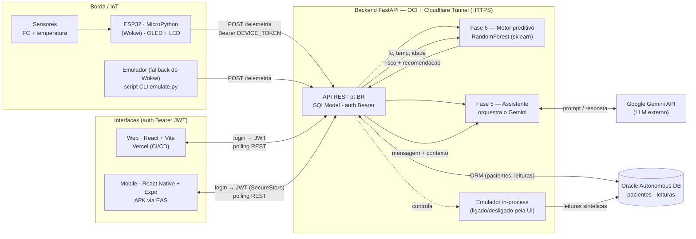
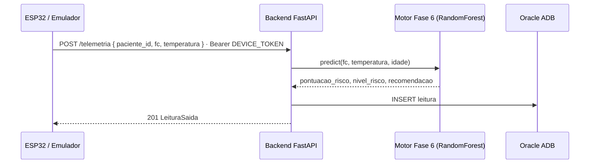
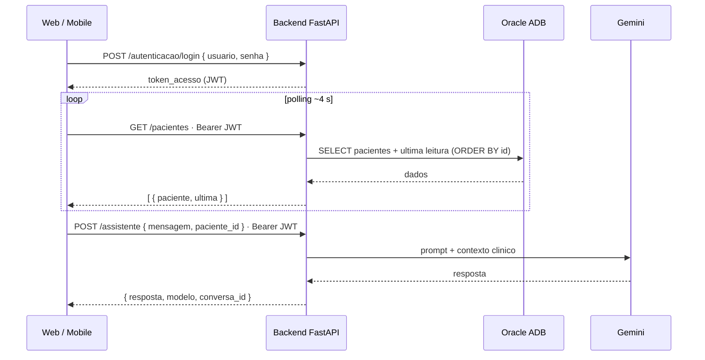
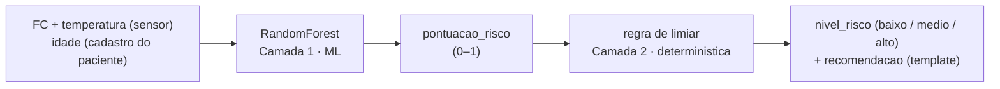

# CardioIA — Arquitetura Final (Fase 7)

Ecossistema fim-a-fim que integra as fases anteriores num produto funcional:
**sensores (IoT em MicroPython) → backend Python → motores de IA → interfaces Web e
Mobile**, com persistência em Oracle e exposição HTTPS via Cloudflare Tunnel.

> Fluxo resumido: **Sensor → MicroPython (ESP32) → Backend FastAPI → APIs de IA (Fase 6 + Gemini) → UI (Web/Mobile)**.

## Visão geral (diagrama de blocos)

## Camadas e tecnologias

| Camada | Tecnologia | Papel |
|---|---|---|
| **Borda / IoT** | ESP32 + **MicroPython** (Wokwi); OLED SSD1306 + LED | Lê FC/temperatura e envia telemetria; feedback visual local |
| **Ingestão (fallback)** | `emulator/emulate.py` (CLI) · emulador in-process (`/emulador`) | Alimenta a frota de pacientes quando não há hardware |
| **Backend** | **Python · FastAPI · SQLModel** (OCI Ubuntu, systemd) | Núcleo integrador; API REST pt-BR; auth Bearer (2 níveis) |
| **IA — Fase 6** | **scikit-learn** RandomForest | Classifica o risco → `pontuacao_risco`, `nivel_risco`, `recomendacao` |
| **IA — Fase 5** | **Google Gemini** (`gemini-3.1-flash-lite`) | Assistente conversacional multi-turno (`/assistente`) |
| **Dados** | **Oracle Autonomous DB** (thin mode, TLS) | Tabelas `pacientes` e `leituras` |
| **Exposição** | **Cloudflare Tunnel** (HTTPS) | URL pública sem abrir portas |
| **Web** | **React 19 + Vite + TS + Tailwind** → **Vercel** (CI/CD) | Painel, dossiê, alertas, assistente (polling) |
| **Mobile** | **React Native + Expo (SDK 56)** → **APK via EAS** | Login, painel, dossiê, assistente; token no SecureStore |

## Fluxo 1 — Ingestão de telemetria

## Fluxo 2 — Consumo pelas interfaces (Web / Mobile)

## Motor preditivo (Fase 6) — duas camadas

O LLM (Gemini) **não** participa do cálculo de risco — atua apenas no `/assistente`.
O texto da recomendação vem de um template por faixa, não do ML.

## Notas de operação

- **Autenticação Bearer em 2 níveis:** **JWT** para os frontends (obtido em `POST /autenticacao/login`) e **`DEVICE_TOKEN`** estático apenas para o dispositivo/emulador no `/telemetria`. O frontend nunca usa o `DEVICE_TOKEN`.
- **URL pública efêmera:** o quick tunnel (`*.trycloudflare.com`) muda se reiniciar. As UIs leem a base URL de configuração (Web: `VITE_API_URL`; Mobile: `app.json → extra.apiUrl`), com override em runtime.
- **Deploy:** Web na **Vercel** (push na `main` → deploy automático); Mobile em **APK via EAS Build** (perfil `preview`); Backend em **systemd** na OCI (`cardioia-api` + `cloudflared-quick`).

> Contrato completo da API: [`../backend/README.md`](../backend/README.md). Como exportar este diagrama para o PDF: abra no GitHub (renderiza o Mermaid) e use *Imprimir → Salvar como PDF*, ou rode `mmdc` (mermaid-cli) sobre os blocos.
