# Ir Além (Fase 7) — desafio extra

Entregável **opcional** da Fase 7: notebook + relatório técnico + evidências de execução.

## Ir Além 1 — Mineração de Processos e Conformidade Clínica (AIRPA)

Análise do *event log* do atendimento de **Infarto Agudo do Miocárdio (IAMCSST)** com
**`pm4py`** (descoberta indutiva, grafo de dependência direcionada e *token replay*) sobre
**10.000 casos / 67.200 eventos sintéticos**: descobre **4 variantes** de processo, mede a
**conformidade** contra o protocolo padrão-ouro (tempo Porta-ECG), o tempo de ciclo e os
**gargalos** críticos.

- **Relatório técnico (PDF, 2 págs):** [`ir-alem-1-relatorio.pdf`](ir-alem-1-relatorio.pdf)
- **Notebook (Colab):** <https://colab.research.google.com/drive/1_2rVyJkpnlFNUaCK00hJ-5aOWKMyR9Wb>
- **Notebook (`.ipynb`):** [`ir-alem-1-colab.ipynb`](ir-alem-1-colab.ipynb)

### Evidências de execução

Prints do notebook (geração do log, descoberta de processos, variantes, DFG de performance, *token replay*/fitness e código):

| | |
|---|---|
| 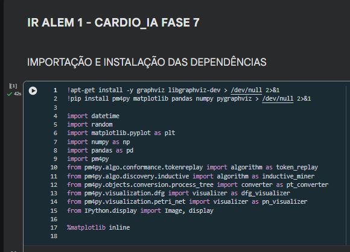 | 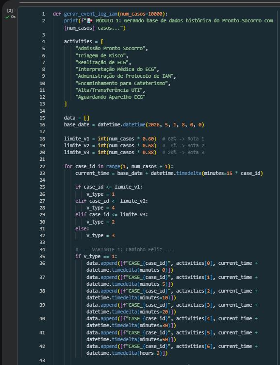 |
| 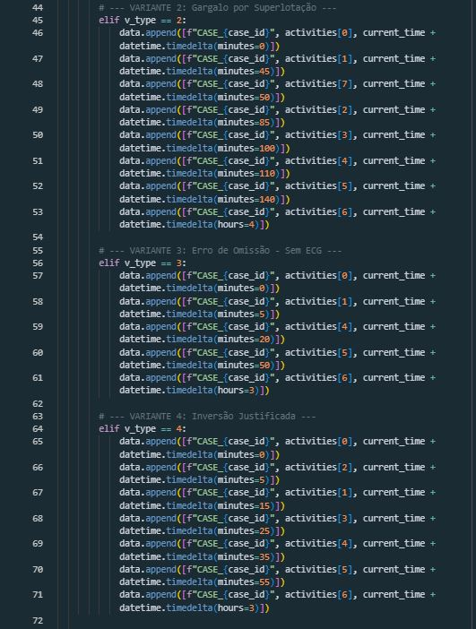 | 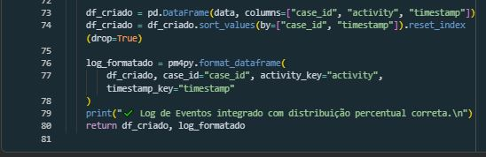 |
| 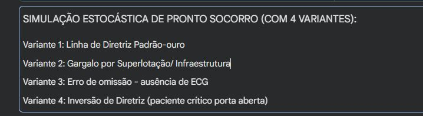 | 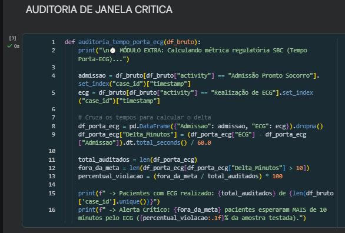 |
| 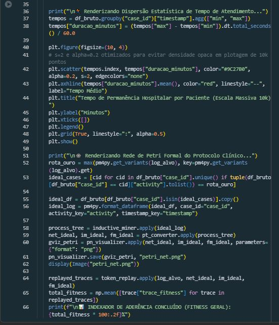 | 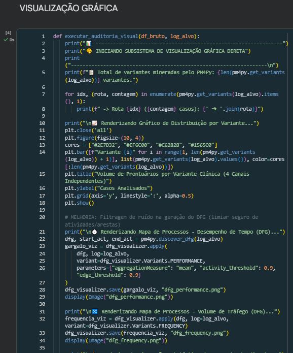 |
| 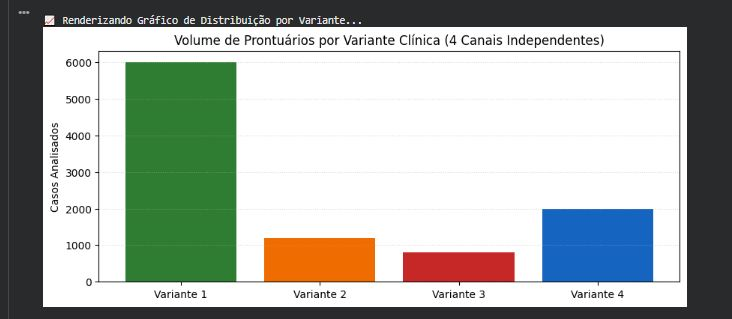 | 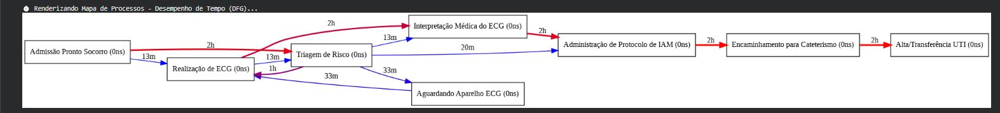 |
| 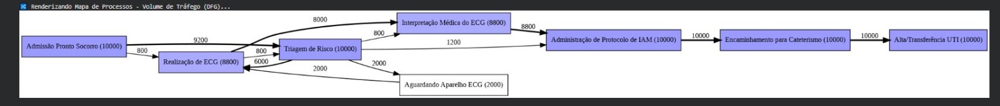 | 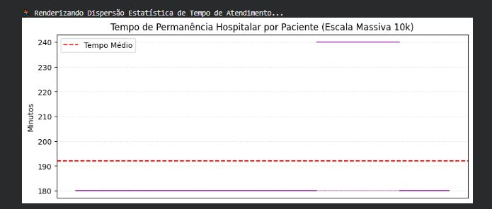 |
| 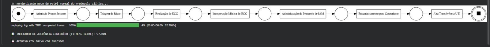 | 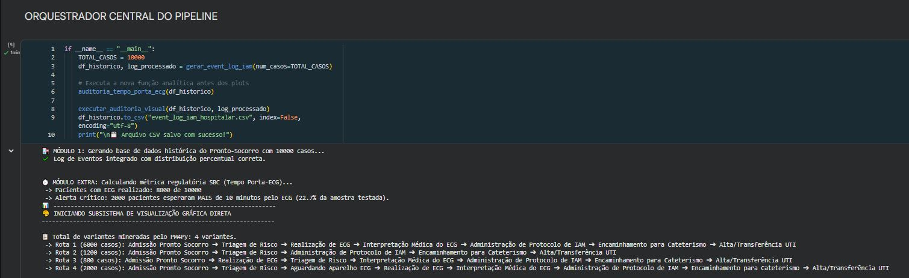 |

> O relatório acima foi reescrito para caber em 2 páginas (requisito do enunciado); o texto-fonte fica em [`ir-alem-1-relatorio.md`](ir-alem-1-relatorio.md).
